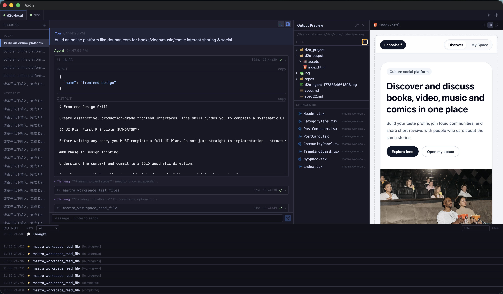
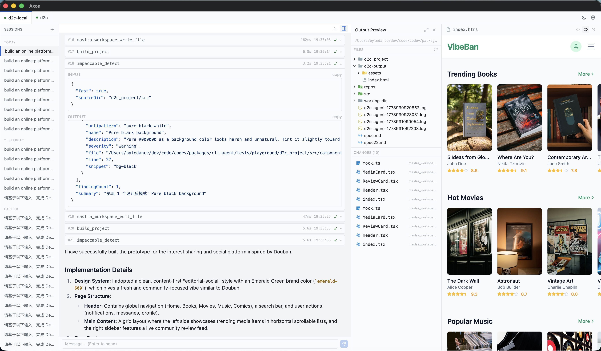

<h1 align="center">
  ⚡ Axon
</h1>

<p align="center">
  <strong>Your AI Agent deserves a proper home.</strong><br/>
  A gorgeous desktop client for the <a href="https://agentclientprotocol.com">Agent Client Protocol</a>.
</p>

<p align="center">
  
  
  
  
</p>

<p align="center">
  <sub>Stop <code>tail -f</code>-ing your agent logs. Start <em>seeing</em> what it thinks.</sub>
</p>

<p align="center">
  <a href="./README.zh-CN.md">🇨🇳 中文文档</a>
</p>

<p align="center">
  
</p>

<p align="center">
  
</p>

---

## 🤔 Why Axon?

AI agents are powerful — but working with them today feels like talking to a black box:

> 🤯 "Why did it call that tool?"  
> 😵‍💫 "What was it *thinking* before responding?"  
> 🫠 "Can I just **see** the JSON-RPC without opening Wireshark?"

**Axon fixes all of that.** One app. Connect your agent. Watch everything unfold in real time — thoughts, tool calls, outputs, raw protocol messages — in a beautiful, native interface.

---

## ✨ Features

### 💬 Chat

- IDE-inspired dark/light UI — feels right at home next to VS Code
- Full Markdown + LaTeX math rendering
- Multi-session with persistent history (survives restarts!)
- Streaming tokens with live thinking display
- Per-session working directory

### 🤖 Multi-Agent

- Connect and interact with **multiple agents simultaneously**
- Tab-based UI — each agent gets its own workspace
- Auto-connect on startup, session auto-recovery
- **Test Connection** — validate CLI + ACP handshake before going live

### 🔌 MCP Server Management

- Configure MCP servers (stdio or HTTP transport)
- Attach MCP servers to individual sessions at creation time
- Full CRUD + JSON import mode for bulk configuration

### 🔍 Agent Observability

- 🟢 **Structured logs** — thoughts, messages, and tool calls, color-coded
- 🛠️ **Tool call cards** — expandable Input/Output with syntax highlighting, sequential numbering, duration + timestamp
- 📡 **RAW mode** — see every JSON-RPC message on the wire
- 📂 **Output Preview** — browse files, view diffs, live HTML preview, open in system browser

### ⚙️ Configuration

- Add unlimited ACP agents with custom commands, args, env vars
- Native directory picker for CWD selection
- Works with **any** ACP-compatible agent — zero vendor lock-in

### 💾 Persistence

- Session history and structured logs persisted in a local SQL.js database
- Data lives in your OS `userData` directory — portable and private

---

## 🚀 Quick Start

### Download

Grab the latest release from [**GitHub Releases**](https://github.com/hirokith/axon/releases):

| Platform | File |
|----------|------|
| macOS (Apple Silicon) | `Axon-x.x.x-arm64.dmg` |
| macOS (Intel) | `Axon-x.x.x-x64.dmg` |
| Windows | `Axon-x.x.x-Setup.exe` |
| Linux | `Axon-x.x.x.AppImage` / `.deb` |

> [!NOTE]
> **macOS users**: On first launch, you may see "Cannot verify developer". Right-click the app → "Open" → click "Open" again (one-time only).  
> Or run in terminal: `xattr -cr /Applications/Axon.app`
>
> **Windows users**: SmartScreen may show a warning. Click "More info" → "Run anyway".

### From Source

```bash
git clone https://github.com/hirokith/axon.git
cd axon
pnpm install
pnpm dev
```

That's it. You're running. 🎉

---

## 🔌 Connect Your Agent

1. Open **Settings** → **Add Agent**
2. Fill in your agent's command:
   | Field | Example |
   |-------|---------|
   | Name | `My Coding Agent` |
   | Command | `node` |
   | Args | `dist/index.js` |
   | CWD | `/path/to/project` |
   | Env | `OPENAI_API_KEY=sk-...` |
3. Go to **Chat** → Select agent → Click **Connect**
4. Start chatting! 🗣️

---

## 🏗️ Tech Stack

| | Technology |
|---|-----------|
| 🖥️ Framework | Electron 42 |
| ⚛️ Frontend | React 19 + TypeScript |
| ⚡ Build | electron-vite + Vite 7 |
| 🎨 Styling | Tailwind CSS v4 |
| 🗃️ State | Zustand (persisted) |
| 🌈 Syntax | Shiki |
| 📐 Math | KaTeX |
| 📝 Markdown | react-markdown + remark-gfm |
| 🎯 Icons | Lucide React + Material Icon Theme |
| 💾 Database | SQL.js (file-backed SQLite) |

---

## 📡 Protocol Support

Axon speaks [ACP](https://agentclientprotocol.com) natively over stdio:

- ✅ `initialize` handshake
- ✅ `session/new` + `session/prompt` with per-session CWD and MCP config
- ✅ Streaming `session/update` (thoughts, messages, tool calls)
- ✅ Permission request dialogs
- ✅ Graceful disconnect
- ✅ Multi-agent concurrent connections
- ✅ MCP server passthrough (stdio & HTTP transports)

---

## 📦 Build for Production

```bash
pnpm build
```

Compiled output lands in `out/`. To package distributable binaries:

```bash
pnpm dist        # current platform
pnpm dist:mac    # macOS (.dmg, .zip)
pnpm dist:win    # Windows (.exe)
pnpm dist:linux  # Linux (.AppImage, .deb)
```

Packaged binaries land in `release/`. Ship it! 🚢

---

## 🤝 Contributing

Got an idea? Found a bug? Building an ACP agent and need something from the client side?

**Open an issue** or send a PR — we'd love to collaborate.

---

## 📄 License

ISC

---

<p align="center">
  <sub>Built with ☕ and curiosity. Made for agent builders, by agent builders.</sub>
</p>
